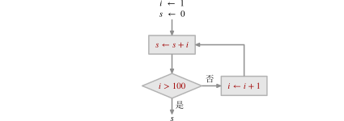

# snail

foo.tex:

```MetaPost
\startMPpage
input snail;
Node a, b, c, d, e, f;
a := proc("context", fullsquare xysized (2.5cm, 1cm));
b := as_star(proc("mpost", like(a)), a, "right");
c := as_star(a, b, "right");
d := as_planet(io("foo.tex"), a, "left");
e := as_planet(io("snail.mp"), b, "top");
f := as_planet(io("foo.pdf"), c, "right");
forsuffixes i = d, e, f: Frame i.frm; i.frm := io_frame(i); endfor;

draw_each a, b, c, d, e, f;
flow_each d.frm => a, a => b, e.frm => b, b => c, c => f.frm;
\stopMPpage
```

Compile foo.tex into foo.pdf which has only a single page:

```console
$ context foo
```

The result is


sum.tex

```
\usemodule[zhfonts]
\startMPpage
input snail;
Node a, b, c, d, e;
a := io("\cbox{\vbox{$i\leftarrow 1$}\vbox{$s\leftarrow 0$}}");
b := as_planet(proc_fit("$s\leftarrow s + i$"), a, "bottom");
c := as_planet(proc("$i > 100$", diamond(b)), b, "bottom");
d := as_planet(proc_fit("$i\leftarrow i + 1$"), c, "right");
e := as_planet(io("$s$"), c, "bottom");

path a.frm, e.frm; pair b.in, d.out; path d_to_b;
a.frm := io_frame(a); e.frm := io_frame(e);
b.in := anchor(b, "right", 0); d.out := anchor(d, "top", 0);
d_to_b := walk(d.out, (_n_ _v_(d.out, b.in)), b.in);

draw_each a, b, c, d, e;
flow a.frm => b; flow b => c; flow d_to_b;
tagged_flow("否", "top", 0.4) c => d;
tagged_flow("是", "right", 0.4) c => e.frm;
\stopMPpage
```

The result is


